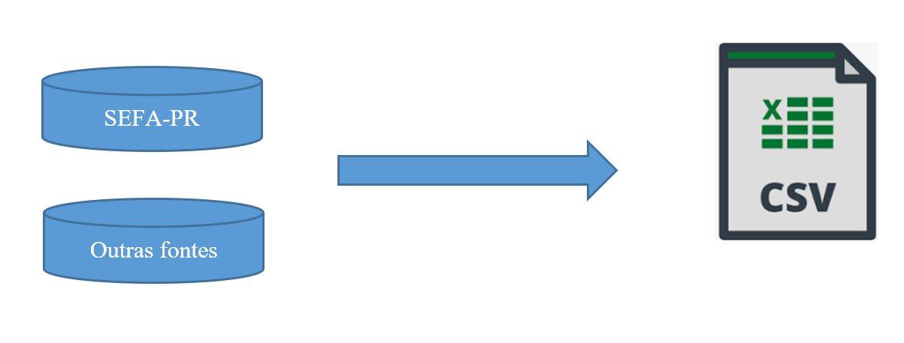
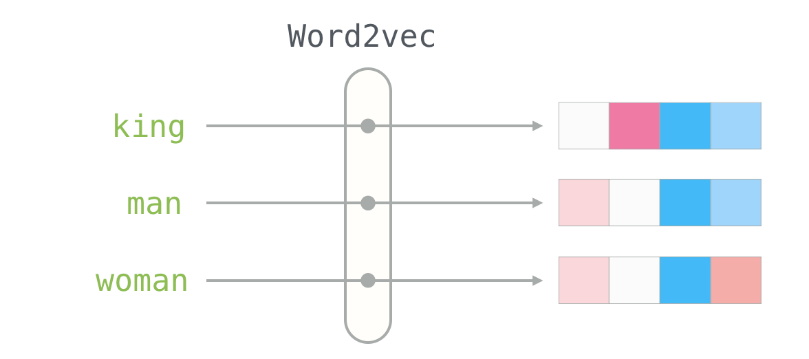
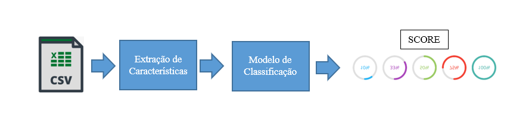
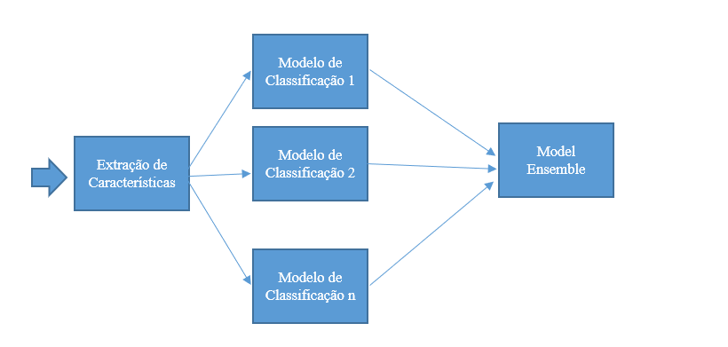

__Definição de Arquitetura de Solução__

1. __Objetivo__

- Este documento fornece uma visão geral de arquitetura de trabalho a ser adotada para a cooperação técnica 004\-2022\-REPR\-AFRAC\.
- O documento explicita aos membros de equipe de projeto as decisões arquiteturalmente significativas para desenvolvimento da solução e dos trabalhos\.
- Os trabalhos têm como objetivo a criação de componente de “Identidade de Produtos”, visando identificar bens e mercadorias com base em características \(não sigilosas\) informadas nos Documentos Fiscais Eletrônicos dos sistemas da SEFA PR\.
- A solução a ser desenvolvida será baseada em componentes de Inteligência Artificial e Aprendizagem de Máquina \(IA & ML\), assim buscando solução abrangente e de caráter genérico para identificação dos produtos\.

1. __Arquitetura • Definições__

- A cooperação técnica em desenvolvimento será desenvolvida utilizando Inteligência Artificial e Aprendizado de Máquina \(IA & ML\)\.
- O ambiente para desenvolvimento será o Jupyter, ambiente open source, com abrangente diversidade de componentes e funcionalidades adequadas ao desenvolvimento de projetos de IA & ML\.
- Além da gama de funcionalidades e de componentes, a possibilidade de instalação do Jupyter em computadores pessoais, servidores físicos ou virtualizados, dockers, ou em máquinas cloud acrescenta flexibilidade e facilidade desejáveis para o projeto\.
- Como regra geral, os dados serão compartilhados utilizarão o padrão CSV, preferencialmente utilizando encoding='utf\-8\-sig', sep =';', decimal=','\. Exemplo:

df\.to\_csv\(csv\_file\_name,encoding='utf\-8\-sig', sep =';', decimal=',', index=False\)

- Quando o uso de arquivos CSV for considerado inviável ou inadequado, poderá ser utilizado acesso direto aos dados do banco analítico da SEFA PR\. Neste contexto, deverão ser observadas as seguintes regras:
	- Os Notebooks Jupyter, com a lógica de processamento, deverão rodar em servidor interno da SEFA PR específico para processamentos de IA & ML\.
	- O acesso ao banco analítico Teradata será realizado através de VIEWs específicas para o trabalho, assim permitindo visualização unicamente de dados não sigilosos acordados e autorizados para uso\.
	- Os acessos ao banco de dados analítico serão realizados por usuário pessoal, assim permitindo controle e registro dos acessos realizados ao data warehouse corporativo individualmente por cada membro da equipe\.
- Os dados disponibilizados pela SEFA PR deverão ser de acesso controlado, i\.e\. acessíveis de forma restrita apenas aos membros do projeto\. Exceções à essa regra serão objeto de análise pela SEFA PR\.
- Desenvolvimento de soluções comunitárias, utilizando terceiros não diretamente nominados na equipe técnica do projeto, poderá ser realizado utilizando dados de produtos públicos \(não fornecidos pela SEFA PR\)\.

1. __Arquitetura • Pipeline de Dados e Modelagem__

- A fonte primária dos dados são os arquivos XML dos documentos eletrônicos\. Fontes secundárias poderão ser adicionadas conforme a disponibilidade / relevância para melhorar a modelagem\. Exemplos ilustrativos: bases de dados geográficos de localização, tabelas de códigos de mercadorias, base de dados linguística entre outros\.
- Vislumbra\-se que para a solução serão gerados modelos em 3 categorias principais:
	- Modelos para extração de características \(“*Feature extraction*”\) cuja finalidade principal é preparar os dados para que sejam tratáveis pelos modelos de ML\. Exemplo: Converter palavras ou sentenças para vetores\.
	- Modelos de classificação\. Modelos que atacam o\(s\) problema\(s\) fim\. Exemplo: Dadas as características \(“*features*”\) extraídas do XML referentes a um item gerar um score de 0 a 100%\. 0 para item classificado errado e 100% para classificado corretamente\.
	- Conjunto de modelos \(“*ensemble*”\)\. Modelo que combina as predições dos modelos de classificação, de forma linear ou usando um outro modelo de maior ordem \(podendo inclusive ser uma rede neural\)\. Essa técnica funciona bem especialmente quando as predições dos modelos de entrada \(de classificação\) têm “baixa correlação”\. Por esse motivo mesmo modelos de classificação pobres podem ser úteis nesse contexto\.
- As tecnologias utilizadas para modelagem e inferência \(“*deploy*” dos modelos\) serão desenvolvidas preferencialmente em linguagem Python\. Com o objetivo de tornar simples exportar o acesso a esses modelos a partir de um servidor rodando Python\. Como já citado, para experimentação e documentação dos experimentos será usado o ambiente Jupyter\.
- Os frameworks PYTHON básicos utilizados incluirão PANDAS, NUMPY, TENSORFLOW, PYTORCH, SCIKIT\-LEARN, SEABORN, MATPLOTLIB\. Outros frameworks poderão ser utilizados em adição ou substituição a alguns desses, caso haja necessidade e/ou melhoria de desempenho/produtividade/interoperabilidade\. Como recomendação adicional, para a utilização de pacotes do Python, Jupyter e alguns desses frameworks aqui citados, sugere\-se utilizar a distribuição Anaconda\.
- Processos automatizados de atualização dos modelos não fazem parte desse escopo, mas poderão ser detalhados posteriormente\. As experimentações nessa fase permitiram compreender melhor, por exemplo, qual a relevância e a taxa recomendável de atualização dos modelos\. Dependendo do resultado, pode fazer sentido desde um processo não automatizado, semi automatizado até eventualmente uma automação em tempo real\.

Pipeline de Dados para Modelagem \(Visão esquemática de componentes\)\.

1 – Extração dos dados para modelagem / experimentação:

                                                                                      

2 – Modelagem para extração de características\. \(Exemplo de um dos possíveis modelos– Descrição para vetor\)

Descrição

Coca\-Cola

Feature

\[0\.1223,0\.541,0\.874,\.\.\.,0\.439\]

3 – Modelos de Classificação

4 – Conjunto de modelos \(ensemble\)

1. __Arquitetura • Componentes da aplicação__

- *Frontend*: Página em Javascript/HTML/CSS\.
	- Interface para o usuário composta minimamente de campos para entrada da linha de identificação da mercadoria\.
	- Chamada ao webservice de consulta do score obedecendo as recomendações de uma API REST\.
	- Visualização do resultado da consulta\.
- *Backend*: Servidor rodando o\(s\) modelo\(s\)
	- Código Python \(necessário\) podendo ser combinado com código NODE\.JS
	- Implementar autenticação do usuário e/ou minimamente modo anônimo com captcha\.
	- Implementar os webservices e o código que ativa os modelos e faz as predições\.
	- Balancear a carga de requisições
